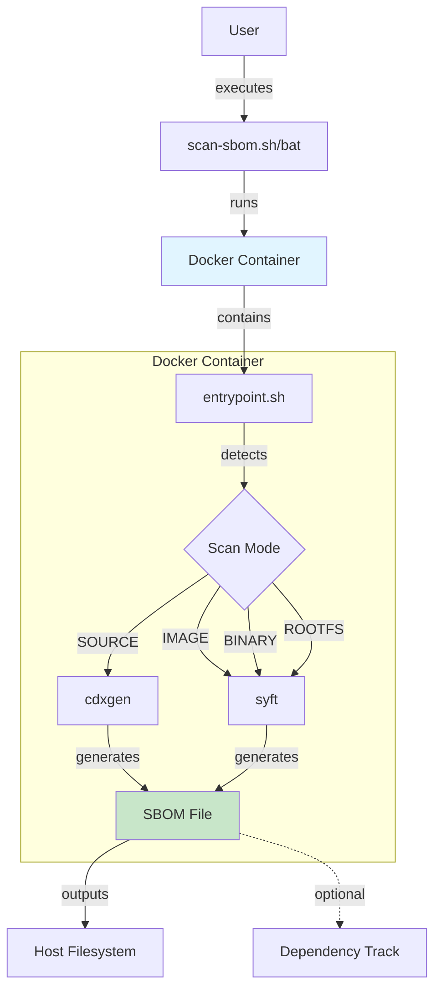
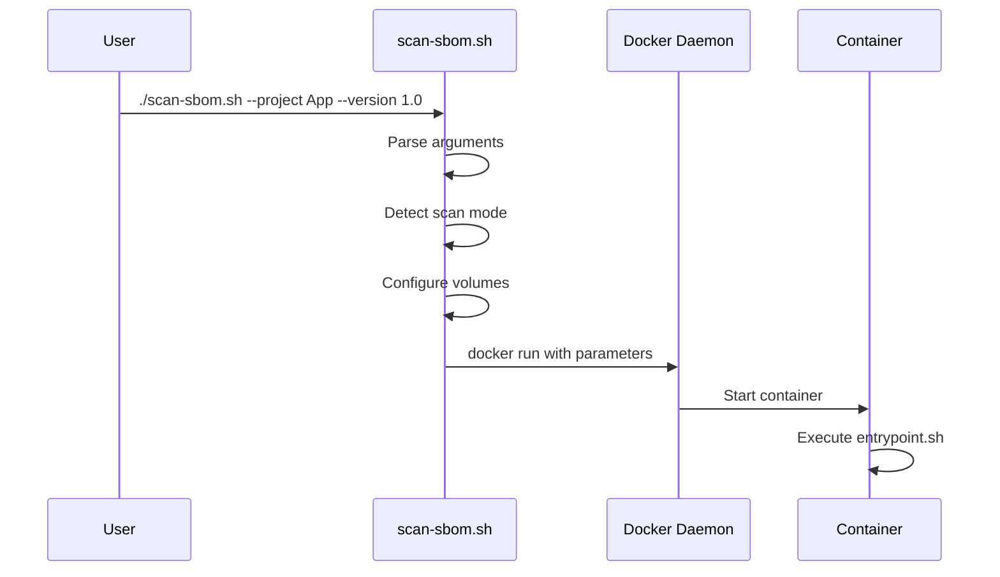
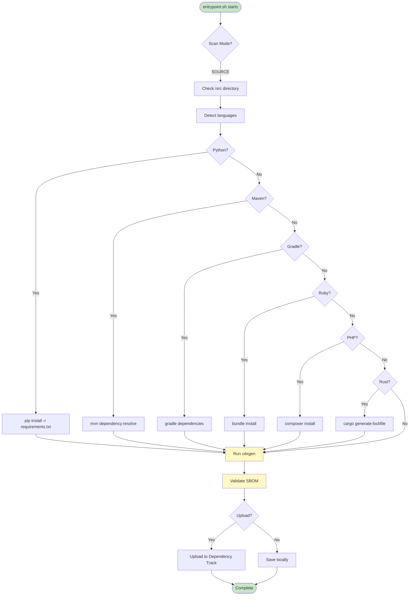
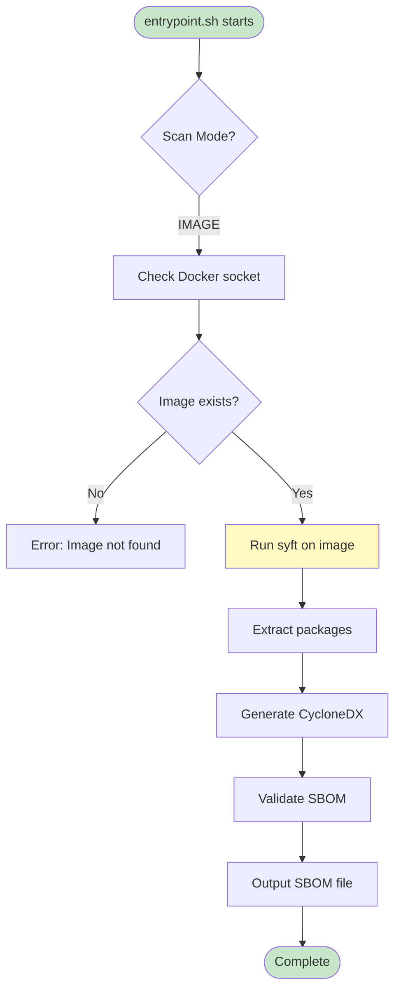

# 아키텍처

> **관련 문서**: [시작하기](getting-started.md) | [기여 가이드](../CONTRIBUTING.md) | [패키지 매니저 추가](contributing/package-manager-guide.md)

SBOM Tools의 전체 시스템 구조, 컴포넌트 설계, 데이터 흐름 및 확장 방법을 설명합니다.

## 목차

- [전체 구조](#전체-구조)
- [컴포넌트 상세](#컴포넌트-상세)
- [데이터 흐름](#데이터-흐름)
- [분석 도구 선택 로직](#분석-도구-선택-로직)
- [Docker 이미지 구성](#docker-이미지-구성)
- [확장 포인트](#확장-포인트)
- [설계 원칙](#설계-원칙)

## 전체 구조

```
┌──────────────────────────────────────────────────────┐
│                  사용자 / CI 환경                     │
└──────────────────────────┬───────────────────────────┘
                           │
                           ▼
┌──────────────────────────────────────────────────────┐
│             scan-sbom.sh  (진입점 래퍼)               │
│  • 인자 파싱 및 유효성 검사                            │
│  • 분석 대상 타입 자동 감지                            │
│    (소스 디렉토리 / Docker 이미지 / 바이너리 파일)      │
│  • Docker 컨테이너 실행 및 볼륨 마운트                 │
│  • 결과 파일을 호스트 디렉토리로 복사                   │
└──────────────────────────┬───────────────────────────┘
                           │  docker run
                           ▼
┌──────────────────────────────────────────────────────┐
│         Docker Container (sbom-scanner)              │
│                                                      │
│  ┌─────────────────────────────────────────────────┐ │
│  │           멀티 언어 런타임 환경                   │ │
│  │  JDK 17 · Python 3 · Node.js 20 · Ruby          │ │
│  │  PHP · Rust · Go · .NET · Build Tools           │ │
│  └─────────────────────────────────────────────────┘ │
│                                                      │
│  ┌───────────────────┐   ┌──────────────────────────┐│
│  │  cdxgen           │   │  syft                    ││
│  │  (소스 코드 분석)  │   │  (이미지/바이너리 분석)   ││
│  └─────────┬─────────┘   └────────────┬─────────────┘│
│            └──────────────┬────────────┘             │
│                           ▼                          │
│                SBOM 정규화 및 출력                    │
└──────────────────────────┬───────────────────────────┘
                           │
                           ▼
                CycloneDX 1.4 SBOM (.json)
```
## 아키텍처 개요




## 컴포넌트 상세

### scan-sbom.sh (래퍼 스크립트)

**역할**: 사용자 인터페이스 및 Docker 오케스트레이션

사용자가 직접 상호작용하는 유일한 진입점입니다. 내부적으로 Docker 컨테이너를 실행하여 분석을 위임하므로, 사용자 환경에 언어별 런타임을 설치할 필요가 없습니다.

**위치**: `scripts/scan-sbom.sh`

---

### Docker 이미지 (sbom-scanner)

**역할**: 격리된 멀티 언어 분석 환경 제공

모든 언어 런타임과 분석 도구를 하나의 이미지에 포함합니다. 분석 환경의 일관성을 보장하고, 호스트 환경에 영향을 주지 않습니다.

**위치**: `docker/Dockerfile`

---

### cdxgen

**역할**: 소스 코드의 패키지 매니저 파일 기반 SBOM 생성

패키지 매니저 잠금 파일(lockfile)을 파싱하여 정확한 의존성 버전 정보를 추출합니다.

| 언어 | 분석 대상 파일 |
|------|--------------|
| Java | `pom.xml`, `build.gradle`, `build.gradle.kts` |
| Python | `requirements.txt`, `pyproject.toml`, `Pipfile.lock`, `poetry.lock` |
| Node.js | `package-lock.json`, `yarn.lock`, `pnpm-lock.yaml` |
| Go | `go.mod`, `go.sum` |
| Rust | `Cargo.lock` |
| Ruby | `Gemfile.lock` |
| PHP | `composer.lock` |
| .NET | `*.csproj`, `packages.lock.json` |

---

### syft

**역할**: Docker 이미지 및 바이너리 파일 분석

설치된 패키지 데이터베이스(dpkg, rpm, apk 등)와 파일 시스템을 스캔하여 컴포넌트를 탐지합니다.

| 대상 | 분석 방식 |
|------|----------|
| Docker 이미지 | 레이어 언팩 후 패키지 DB 스캔 |
| 바이너리 파일 | 파일 매직 및 패키지 시그니처 탐지 |
| RootFS 디렉토리 | 파일 시스템 전체 스캔 |

## 데이터 흐름

```
입력 (소스 디렉토리 / Docker 이미지 / 바이너리 파일)
    │
    ▼
타입 자동 감지
    │
    ├─[소스 디렉토리]──→ cdxgen
    │                       └──→ 패키지 매니저 파일 파싱
    │                       └──→ 의존성 트리 구성
    │
    └─[이미지 / 바이너리]──→ syft
                               └──→ 파일시스템 / 레이어 스캔
                               └──→ 패키지 메타데이터 추출
    │
    ▼
CycloneDX JSON 생성
    │
    ▼
{ProjectName}_{Version}_bom.json
```

## 파이프라인 흐름

### 1. 사용자 호출



### 2. 소스 코드 분석 흐름



### 3. Docker 이미지 분석 흐름



## 분석 도구 선택 로직

`scan-sbom.sh` 내부에서 `--target` 인자를 기준으로 아래와 같이 도구를 선택합니다.

```bash
if [[ "$TARGET" == *":"* && "$TARGET" != "./"* ]]; then
    # "image:tag" 형식 → Docker 이미지
    TOOL="syft"
    MODE="docker-image"
elif [[ -f "$TARGET" ]]; then
    # 파일 경로 → 바이너리
    TOOL="syft"
    MODE="binary"
else
    # 디렉토리 (기본값) → 소스 코드
    TOOL="cdxgen"
    MODE="source"
fi
```

## Docker 이미지 구성

```dockerfile
# 베이스: Ubuntu 22.04 (linux/amd64, linux/arm64 멀티 아키텍처 지원)
FROM ubuntu:22.04

# 언어 런타임 설치
RUN apt-get install -y openjdk-17-jdk python3 nodejs ruby php golang

# SBOM 분석 도구 설치
RUN npm install -g @cyclonedx/cdxgen
RUN curl -sSfL https://raw.githubusercontent.com/anchore/syft/main/install.sh | sh

ENTRYPOINT ["/opt/sbom-scanner/entrypoint.sh"]
```

이미지 크기를 최소화하기 위해 빌드 도구는 꼭 필요한 것만 포함합니다.

## 확장 포인트

### 새로운 언어 지원 추가

1. `docker/Dockerfile`에 언어 런타임 추가
2. cdxgen 또는 syft의 지원 여부 확인
3. 지원하지 않는 경우 커스텀 분석 스크립트 작성
4. `examples/{언어}/` 디렉토리에 예제 프로젝트 추가
5. `tests/cases/test-{언어}.sh` 테스트 케이스 작성

자세한 절차는 [패키지 매니저 추가 가이드](contributing/package-manager-guide.md)를 참고하세요.

### 새로운 출력 형식 지원

현재는 CycloneDX 1.4 JSON만 지원합니다. SPDX 등 다른 형식을 추가하려면 출력 변환 레이어(`entrypoint.sh` 하단)를 수정하면 됩니다.

## 설계 원칙

**격리성**: Docker 컨테이너를 통해 호스트 환경에 영향을 주지 않습니다.

**일관성**: 모든 언어에 대해 동일한 인터페이스(`scan-sbom.sh`)를 제공합니다.

**표준 준수**: CycloneDX 공식 스펙을 엄격히 준수합니다.

**확장성**: 새로운 언어나 도구를 최소한의 변경으로 추가할 수 있도록 설계되었습니다.

**멱등성**: 동일한 입력에 대해 동일한 출력을 생성합니다 (타임스탬프 제외).
